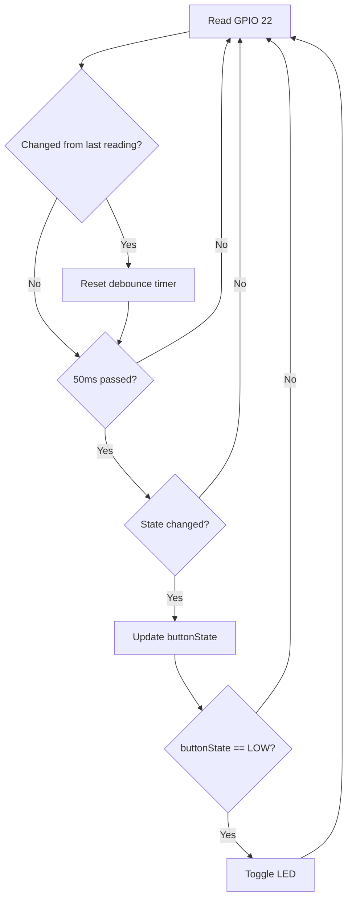

https://wokwi.com/projects/462628726482164737

```mermaid
flowchart TD
    A[Read GPIO 22] --> B{Changed from last reading?}
    B -- Yes --> C[Reset debounce timer]
    B -- No --> D{50ms passed?}
    C --> D
    D -- No --> A
    D -- Yes --> E{State changed?}
    E -- No --> A
    E -- Yes --> F[Update buttonState]
    F --> G{buttonState == LOW?}
    G -- Yes --> H[Toggle LED]
    G -- No --> A
    H --> A
```