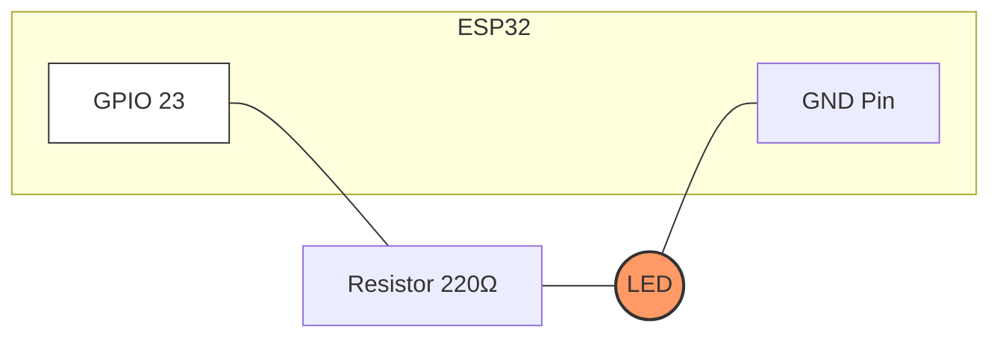

```mermaid
graph LR
    subgraph ESP32
        p23[GPIO 23]
        gnd[GND Pin]
    end

    p23 --- R1[Resistor 220Ω]
    R1 --- LED((LED))
    LED --- gnd

    style LED fill:#f96,stroke:#333,stroke-width:2px
    style p23 fill:#fff,stroke:#333
```