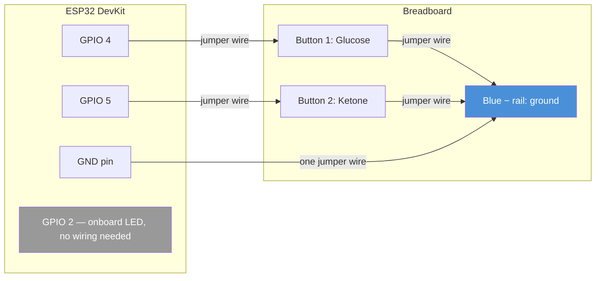
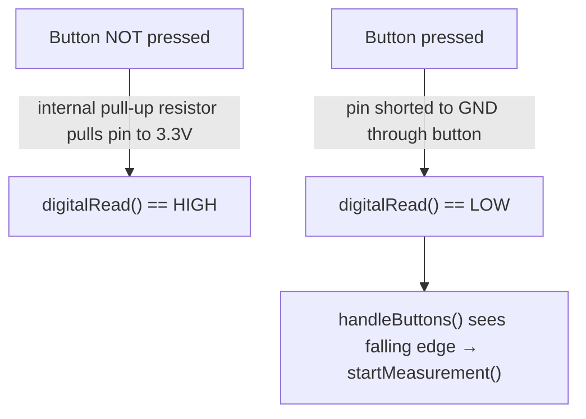

# Simple BLE device - send random Ketone or Glucose values by pressinf respective button 

```mermaid
graph LR
    subgraph ESP32 [ESP32 DevKit]
        GPIO4[GPIO 4]
        GPIO5[GPIO 5]
        GND[GND pin]
        LED2[GPIO 2 — onboard LED, no wiring needed]
    end

    subgraph Breadboard
        BTN_G[Button 1: Glucose]
        BTN_K[Button 2: Ketone]
        RAIL[Blue − rail: ground]
    end

    GPIO4 -- "jumper wire" --> BTN_G
    GPIO5 -- "jumper wire" --> BTN_K
    BTN_G -- "jumper wire" --> RAIL
    BTN_K -- "jumper wire" --> RAIL
    GND -- "one jumper wire" --> RAIL

    style RAIL fill:#4a90d9,color:#fff
    style LED2 fill:#999,color:#fff
```

```mermaid
graph TD
    A[Button NOT pressed] -->|internal pull-up resistor pulls pin to 3.3V| B["digitalRead() == HIGH"]
    C[Button pressed] -->|"pin shorted to GND through button"| D["digitalRead() == LOW"]
    D --> E["handleButtons() sees falling edge → startMeasurement()"]
```