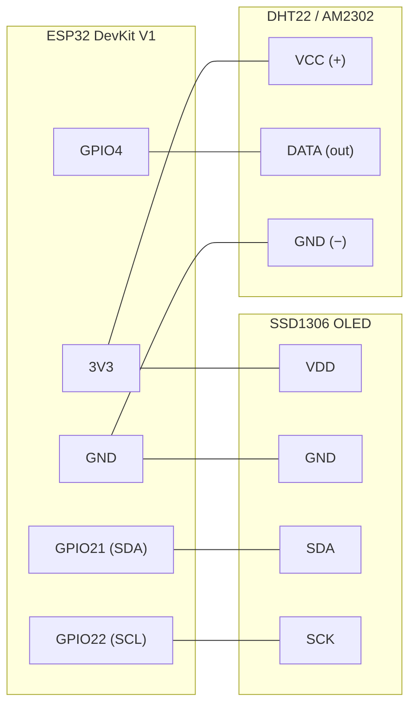

# ESP32 Temp & Humidity with OLED Screen

Reads a DHT22 (AM2302) sensor every 2 seconds and shows temperature, humidity, and heat index on a 128×64 SSD1306 OLED. Readings are also logged to the serial monitor at 115200 baud.

## Hardware

- **Board:** ESP32-WROOM-32D (DevKit V1)
- **Sensor:** DHT22 / AM2302 temperature & humidity sensor
- **Display:** 0.96" I2C SSD1306 128x64 OLED

## Wiring



| ESP32 | DHT22 | OLED |
|-------|-------|------|
| 3V3 | VCC | VDD |
| GND | GND | GND |
| GPIO4 | DATA | — |
| GPIO21 (SDA) | — | SDA |
| GPIO22 (SCL) | — | SCK |

Notes:

- Both devices share the 3V3 and GND rails — a breadboard makes this easy.
- Bare DHT22 sensors (4 pins) need a **10 kΩ pull-up resistor** between DATA and VCC. Most 3-pin breakout modules already include it on the board.
- Some SSD1306 modules label VCC/SCL as VDD/SCK — same signals, same wiring.

## I2C address

Default is `0x3C`. Some modules ship on `0x3D` instead — if the screen stays blank, run the I2C scanner from [lcd-screen/variants/i2c_scanner.cpp](../../lcd-screen/variants/i2c_scanner.cpp) to find the actual address and update `OLED_ADDRESS` in `src/main.cpp`.

## What the screen shows

```
Temp & Humidity        <- header (small text)
23.5 °C                <- temperature (large text)
45.2 %                 <- humidity (large text)
Feels like 23.1 C      <- heat index (small text)
```

On startup it shows "Waiting for sensor..." until the first successful read.

## Build & flash

```sh
pio run -t upload   # build and flash
pio device monitor  # serial output at 115200 baud
```

## Troubleshooting

| Symptom | Likely cause |
|---|---|
| `SSD1306 not found` on serial, blank screen | SDA/SCK swapped, loose wire, or wrong I2C address — see [I2C address](#i2c-address) |
| `Failed to read from DHT22 sensor` | DATA not on GPIO4, missing pull-up on a bare sensor, or loose power wire |
| Readings are `nan` only sometimes | DHT22 needs ~2 s between reads (already handled in code); check for a flaky breadboard contact |
| Nothing on serial | Monitor baud must be **115200** |
